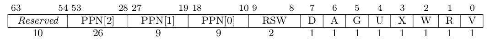

# lab2 实验报告

# 1 实验说明
本实验主要实现了引入页表情况下内核地址与应用地址隔离的情况下ch3新增的两个系统调用，以及在mmap和unmap两个简单分配内存的系统调用，核心在于内核如何处理应用传来的自己的地址空间的虚拟地址。

# 2 简答题
1. 问题1
   
   最低的8位[0:7]是标志位，它们的含义如下：

   仅当 V(Valid) 位为 1 时，页表项才是合法的；

   R/W/X 分别控制索引到这个页表项的对应虚拟页面是否允许读/写/取指；

   U 控制索引到这个页表项的对应虚拟页面是否在 CPU 处于 U 特权级的情况下是否被允许访问；

   G 忽略；

   A(Accessed) 记录自从页表项上的这一位被清零之后，页表项的对应虚拟页面是否被访问过；

   D(Dirty) 则记录自从页表项上的这一位被清零之后，页表项的对应虚拟页表是否被修改过。
1. 问题2
   1. mcause 寄存器中会保存发生中断异常的原因，其中 Exception Code 为 12 时发生指令缺页异常，为 15 时发生 store/AMO 缺页异常，为 13 时发生 load 缺页异常。。scause: 中断/异常发生时， CSR 寄存器 scause 中会记录其信息， Interrupt 位记录是中断还是异常， Exception Code 记录中断/异常的种类sstatus: 记录处理器当前状态，其中 SPP 段记录当前特权等级。stvec: 记录处理 trap 的入口地址，现有两种模式 Direct 和 Vectored 。sscratch: 其中的值是指向hart相关的S态上下文的指针，比如内核栈的指针。sepc: trap 发生时会将当前指令的下一条指令地址写入其中，用于 trap 处理完成后返回。stval: trap 发生进入S态时会将异常信息写入，用于帮助处理 trap ，其中会保存导致缺页异常的虚拟地址
   
   2. Lazy策略一定不会比直接加载策略慢，分配内存时暂时不进行分配，只是将记录下来，访问缺页时会触发缺页异常，在`trap handler`中处理相应的异常，在此时将内存加载或分配即可。处理10G连续页面，页表大概需要10GB/2MB*4KB=20MB左右（忽略2级页表大小）
   
   3. 可以为用户程序提供比实际物理内存更大的内存空间。页面失效会将标志位V置为0。将置换出的物理页面保存在磁盘中，在之后访问再次触发缺页异常时将该页面写入内存。
   
2. 问题3
   1. 将内核页面的pte的U标志位设置为0。

   2. 在内核和用户态之间转换时不需要更换页表，也就不需要跳板，可以像之前一样直接切换上下文。

   3. 双页表实现下用户程序和内核转换时、用户程序转换时都需要更换页表，而对于单页表操作系统，不同用户线程切换时需要更换页表。

# 3荣誉准则
1. 在完成本次实验的过程（含此前学习的过程）中，我曾分别与 以下各位 就（与本次实验相关的）以下方面做过交流，还在代码中对应的位置以注释形式记录了具体的交流对象及内容：

2. 此外，我也参考了 以下资料 ，还在代码中对应的位置以注释形式记录了具体的参考来源及内容：

3. 我独立完成了本次实验除以上方面之外的所有工作，包括代码与文档。 我清楚地知道，从以上方面获得的信息在一定程度上降低了实验难度，可能会影响起评分。

4. 我从未使用过他人的代码，不管是原封不动地复制，还是经过了某些等价转换。 我未曾也不会向他人（含此后各届同学）复制或公开我的实验代码，我有义务妥善保管好它们。 我提交至本实验的评测系统的代码，均无意于破坏或妨碍任何计算机系统的正常运转。 我清楚地知道，以上情况均为本课程纪律所禁止，若违反，对应的实验成绩将按“-100”分计。

